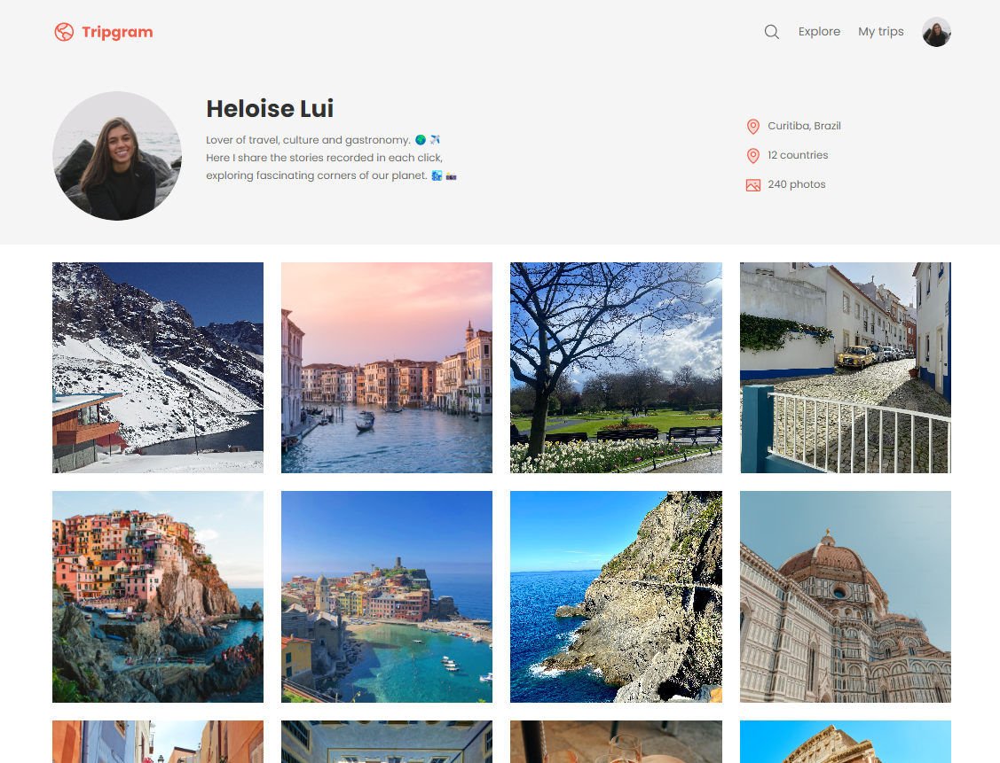

# Tripgram | Travel Profile

This is a simple project of a travel profile, created as part of my ongoing learning and to keep my web development skills up to date. The idea is to showcase a profile displaying travel photos, with information about the traveller, visited locations, and a short summary about the passion for travel, culture, and gastronomy.

## 📋 Overview

The project is a static webpage built with HTML and CSS, following responsive design practices and modular styling. The page simulates a user profile on a fictional travel platform called "Tripgram," where the user shares their adventures around the world through photos.

## 🚀 Technologies Used

- **HTML**: Structure of the webpage.
- **CSS**: Styling of the webpage, including responsive design.
- **Google Fonts**: Used for typography.
- **SVG Icons**: Used for the icons in the profile and navigation.

## 💡 Project Idea

This project was created to practise and maintain my knowledge of HTML and CSS. It helped me focus on organising CSS files, applying design techniques, and working with images and icons.

## 📂 Project Structure

- **index.html**: The main HTML file that structures the webpage.
- **styles**: A folder containing all the CSS files, organised by component (e.g., global, header, footer).
- **assets**: A folder containing images, icons, and the logo used in the project.

## 🛠️ How to Use

1. Clone the repository to your local machine.
2. Open `index.html` in your web browser to view the project.
